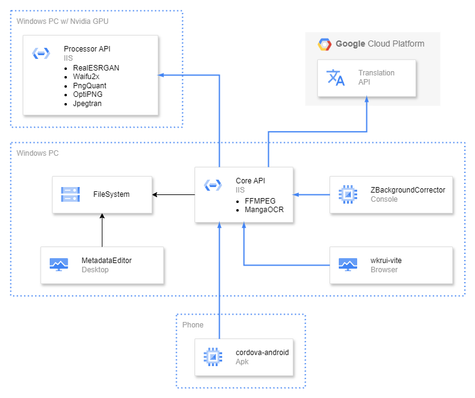

# Multi-Project Media Management Application

This repository showcases a multi-project system that integrates advanced AI tools, Google Translate API, and modern tech stack to manage, process, and display media files across multiple devices.

## System Context Diagram

Below is the high-level architecture illustrating how each project interacts within the system.

## Project Overview

**Core API (.NET 9)**  
- Tech: .NET 9, SignalR, IIS, FFMPEG, MangaOCR
- Role: Central hub for media library management and backend services

**Processor API (.NET 9)**  
- Tech: .NET 9, RealESRGAN, Waifu2x, PngQuant, OptiPNG, JpegTran  
- Role: Image processing (upscaling, compression) service. Requires a PC with NVIDIA GPU

**wkrui-vite (React)**  
- Tech: React (Latest), Vite, Ant Design  
- Role: Web UI for displaying and interacting with the media library

**wkr-cordova (Mobile)**  
- Tech: Cordova (Android)  
- Role: Wraps the web app from wkrui-vite into a .apk app

**MetadataEditor (WinForms)**  
- Tech: .NET WinForms  
- Role: Compile files into "Album" to be added in the media library

**ZBackgroundCorrector (Console)**  
- Tech: .NET 9
- Role: Continuously analyze the media library and perform upscaling or compression if necessary

## Note on Accessibility

This is a public fork of my personal project, with sensitive information removed for security reason. As such, certain configurations or files may be incomplete, thus requiring additional effort to actually build and run it.